# PID 销售趋势映射 — 需求文档（基础版）

> 以需求为一级维度；源数据取数方式在文末「源数据统一梳理」统一说明。参照 Excel：`docs/PID销售趋势映射表.xlsx`（需求 / 映射表 / 源数据路径）。

---

## 一、需求一：PID 维度 GMV 计算表

### 1.1 需求描述

- **输入**：源数据统一梳理中的 5 张表（尤其全部笔订单、全渠道商品表）+ 映射表规则。
- **参照**：`1店PID维度的数据监测工具表-7天数据` 中的 **GMV计算** 结构与字段。
- **目标**：按店铺、按 PID 产出「GMV 计算」数据表，为数据看板提供客单价、补贴、总 GMV 等。
- **店铺**：同上。

### 1.2 流程

1. 从「全部笔订单」提取 Paid Time 日期；通过 全部笔订单.Seller SKU 关联 全渠道商品表.父ASIN 得到 PID。
2. 按映射表规则筛选（如 Cancelation/Return Type≠Cancel）、按 PID 汇总：营业总额、商家折扣、补贴、运费、单量、实付总价等。
3. 计算：总GMV=营业总额-商家折扣+运费；每单补贴=补贴/单量；客单价=实付总价/单量（保留两位小数）。
4. 店铺字段由导出店铺或人工设置。
5. 产出：**1店PID维度的数据监测工具表-7天数据-》GMV计算**（或等价多店表），供数据看板使用。

### 1.3 映射表（GMV计算）

- **最终数据表**：`1店PID维度的数据监测工具表-7天数据-》GMV计算`
- **规则**：**关联字段为空** → 该目标字段为**计算**，计算逻辑见 **A 列**（条件/需求公式）；**关联字段有值** → 为**映射**，按关联字段 + 源数据表 + 源字段取数。
- 底表：全渠道商品表
- 相关表：tk 订单表（sku 维度）

| 类型  | 目标字段            | 计算逻辑（A列）                                                                                                                                                                                                                                                              | 关联字段                               | 源数据表   | 源字段名称                                                                           | 在源字段第几列 |
| --- | --------------- | --------------------------------------------------------------------------------------------------------------------------------------------------------------------------------------------------------------------------------------------------------------------- | ---------------------------------- | ------ | ------------------------------------------------------------------------------- | ------- |
| 计算  | 日期              | 提取Paid Time的日期                                                                                                                                                                                                                                                        | —                                  | —      | Paid Time                                                                       | 28      |
| 映射  | PID             | 全渠道商品表.父ASIN                                                                                                                                                                                                                                                          | 全部笔订单（Seller SKU ） 与 全渠道商品表（父ASIN） | 全渠道商品表 | 父ASIN                                                                           | —       |
| 映射  | 营业总额            | 全部笔订单.Cancelation/Return Type、SKU Subtotal Before Discount（=SUMIFS(订单完整!$Q:$Q,订单完整!A:A,D11)-SUMIFS(订单完整!$Q:$Q,订单完整!A:A,D11,订单完整!$H:$H,"Cancel")）                                                                                                                     | 全部笔订单（Seller SKU ） 与 全渠道商品表（父ASIN） | 全部笔订单  | Cancelation/Return Type、SKU Subtotal Before Discount                            | 4,13    |
| 映射  | 商家折扣            | 全部笔订单.Cancelation/Return Type、SKU Seller Discount（=SUMIFS(订单完整!$S:$S,订单完整!A:A,D11)-SUMIFS(订单完整!$S:$S,订单完整!A:A,D11,订单完整!$H:$H,"Cancel")）                                                                                                                              | 全部笔订单（Seller SKU ） 与 全渠道商品表（父ASIN） | 全部笔订单  | Cancelation/Return Type、SKU Seller Discount                                     | 4,15    |
| 映射  | 运费              | 全部笔订单.Cancelation/Return Type、Original Shipping Fee、Shipping Fee Seller Discount（=SUMIFS(订单完整!$V:$V,订单完整!$A:$A,D12)-SUMIFS(订单完整!$V:$V,订单完整!$A:$A,D12,订单完整!$H:$H,"Cancel")-(SUMIFS(订单完整!$W:$W,订单完整!$A:$A,D12)-SUMIFS(订单完整!$W:$W,订单完整!$A:$A,D12,订单完整!$H:$H,"Cancel"))） | 全部笔订单（Seller SKU ） 与 全渠道商品表（父ASIN） | 全部笔订单  | Cancelation/Return Type、Original Shipping Fee、Shipping Fee Seller Discount      | 4,18,19 |
| 计算  | 总GMV            | 总GMV=营业总额-商家折扣+运费（=E13-F13+G13）                                                                                                                                                                                                                                      | —                                  | —      | —                                                                               | —       |
| 映射  | 单量              | 全部笔订单.Cancelation/Return Type、Quantity、Order Amount（=SUMIFS(订单完整!$N:$N,订单完整!A:A,D13)-SUMIFS(订单完整!$N:$N,订单完整!A:A,D13,订单完整!$H:$H,"Cancel")-SUMIFS(订单完整!$N:$N,订单完整!A:A,D13,订单完整!AC:AC,"0")）                                                                             | 全部笔订单（Seller SKU ） 与 全渠道商品表（父ASIN） | 全部笔订单  | Cancelation/Return Type、Quantity、Order Amount                                   | 4,10,25 |
| 映射  | 补贴              | 全部笔订单.Cancelation/Return Type、SKU Platform Discount（=SUMIFS(订单完整!$R:$R,订单完整!A:A,D13)-SUMIFS(订单完整!$R:$R,订单完整!A:A,D13,订单完整!$H:$H,"Cancel")）                                                                                                                            | 全部笔订单（Seller SKU ） 与 全渠道商品表（父ASIN） | 全部笔订单  | Cancelation/Return Type、SKU Platform Discount                                   | 4,14    |
| 映射  | 每单补贴            | 全部笔订单.Cancelation/Return Type、Original Shipping Fee、Shipping Fee Seller Discount（=J13/I13）                                                                                                                                                                           | 全部笔订单（Seller SKU ） 与 全渠道商品表（父ASIN） | 全部笔订单  | Cancelation/Return Type、Original Shipping Fee、Shipping Fee Seller Discount      | 4,18,19 |
| 计算  | 店铺              | 店铺=导出的店铺，需要人工设置（根据导入的文件进行适配）                                                                                                                                                                                                                                         | —                                  | —      | —                                                                               | —       |
| 映射  | 实付总价（折扣价-补贴+运费） | 全部笔订单.Cancelation/Return Type、SKU Subtotal After Discount、Shipping Fee After Discount（=SUMIFS(订单完整!D:D,订单完整!A:A,D7)-SUMIFS(订单完整!D:D,订单完整!A:A,D7,订单完整!$H:$H,"Cancel")）                                                                                                | 全部笔订单（Seller SKU ） 与 全渠道商品表（父ASIN） | 全部笔订单  | Cancelation/Return Type、SKU Subtotal After Discount、Shipping Fee After Discount | 4,16,17 |
| 计算  | 客单价（实付总价/单量）    | 客单价（实付总价/单量）=实付总价（折扣价-补贴+运费）/单量,取小数点两位数（=M6/I6）                                                                                                                                                                                                                      | —                                  | —      | —                                                                               | —       |

### 1.4 最终目标结果

需求一达成的目标：**PID 维度 GMV 计算表**，字段与「1店PID维度的数据监测工具表-7天数据-》GMV计算」一致，供数据看板及后续分析使用。

**GMV 计算表最终呈现示意**

下图为需求一 GMV 计算表的目标呈现效果：按日期、按 PID（及辅助列）展示营业总额、商家折扣、运费、总GMV、单量、补贴、每单补贴、店铺、实付总价（折扣价-补贴+运费）、客单价（实付总价/单量）等字段，与映射表「GMV计算」一致，供数据看板取数。

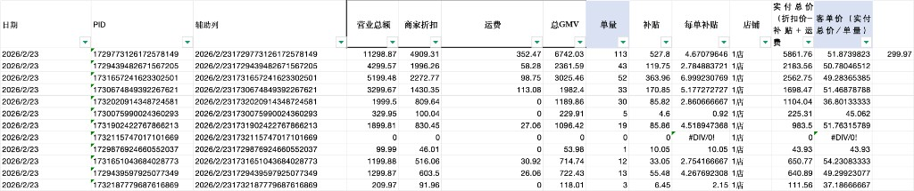

---

## 二、需求二：PID 维度数据看板

### 2.1 需求描述

- **输入**：源数据统一梳理中的 5 张表（见本文「三、源数据统一梳理」）+ 映射表规则。
- **参照**：`1店PID维度的数据监测工具表-7天数据` 中的 **数据看板** 结构与字段。
- **目标**：按店铺、按 PID 维度做出「数据看板」，支持按日期、店铺、PID 等筛选查看。
- **店铺**：美国TK-艾斯特尼-美区跨境1店（先做）、美区跨境2店、美区跨境3店（先做）、美国TK-艾斯特尼-英国直邮店:GB（先做）。

### 2.2 流程

1. 使用源数据统一梳理中的 5 张表，按映射表关联（product_list-ID、全渠道商品表-父ASIN、GMV计算表等）。
2. 按「数据看板」目标字段与公式，计算日期、PID、主推SPU、客单价、财务GMV、商品卡/直播/短视频 GMV 及占比、曝光/浏览/点击率/转化率、挂车量、广告消耗与 ACOAS 等。
3. 产出并展示：**1店PID维度的数据监测工具表-7天数据-》数据看板**（或等价多店数据看板）。

### 2.3 映射表（数据看板）

- **最终数据表**：`1店PID维度的数据监测工具表-7天数据-》数据看板`
- **规则**：**关联字段为空** → 该目标字段为**计算**，计算逻辑见 **A 列**（条件/需求公式）；**关联字段有值** → 为**映射**，按关联字段 + 源数据表 + 源字段取数。
- 底表：product_list（sku的明细）
- 相关表：全渠道商品表、产品活动数据（Product campaign data）、tk订单表

| 类型  | 目标字段              | 计算逻辑（A列）                                             | 关联字段                                            | 源数据表                        | 源字段名称         | 在源字段第几列 |
| --- | ----------------- | ---------------------------------------------------- | ----------------------------------------------- | --------------------------- | ------------- | ------- |
| 计算  | 日期                | 提取表格右上角的日期                                           | —                                               | product_list                | (表头/图片)       | —       |
| 计算  | PID               | 直接取源表：product_list.ID                                | —                                               | product_list                | ID            | —       |
| 映射  | 主推SPU             | 全渠道商品表.SPU                                           | 全渠道商品表（父ASIN） 与 product_list（ID）                | 全渠道商品表                      | SPU           | —       |
| 映射  | 客单价               | 1店PID维度的数据监测工具表-7天数据-》GMV计算.客单价（实付总价/单量）             | PID与product_list（ID）                            | 1店PID维度的数据监测工具表-7天数据-》GMV计算 | 客单价（实付总价/单量）  | —       |
| 映射  | 平均补贴/单            | 1店PID维度的数据监测工具表-7天数据-》GMV计算.每单补贴                     | PID与product_list（ID）                            | 1店PID维度的数据监测工具表-7天数据-》GMV计算 | 每单补贴          | —       |
| 映射  | 财务GMV             | 1店PID维度的数据监测工具表-7天数据-》GMV计算.总GMV                     | PID与product_list（ID）                            | 1店PID维度的数据监测工具表-7天数据-》GMV计算 | 总GMV          | —       |
| 映射  | 商品交易总额4           | product_list.GMV                                     | -                                               | product_list                | GMV           | 4       |
| 映射  | 成交件数5             | product_list.成交件数                                    | -                                               | product_list                | 成交件数          | 5       |
| 映射  | 订单数6              | product_list.订单数                                     | -                                               | product_list                | 订单数           | 6       |
| 映射  | 商品卡GMV31          | product_list.商品卡 GMV                                 | -                                               | product_list                | 商品卡 GMV       | 32      |
| 映射  | 直播GMV15           | product_list.直播 GMV                                  | -                                               | product_list                | 直播 GMV        | 16      |
| 映射  | 短视频GMV23          | product_list.视频 GMV                                  | -                                               | product_list                | 视频 GMV        | 24      |
| 计算  | 商品卡GMV占比          | 商品卡GMV占比=商品卡 GMV/（商品卡 GMV+直播 GMV+视频 GMV）,取小数点两位数的百分比 | —                                               | —                           | —             | —       |
| 计算  | 直播GMV占比           | 直播GMV占比=直播 GMV/（商品卡 GMV+直播 GMV+视频 GMV）,取小数点两位数的百分比   | —                                               | —                           | —             | —       |
| 计算  | 短视频GMV占比          | 短视频GMV占比=视频 GMV/（商品卡 GMV+直播 GMV+视频 GMV）,取小数点两位数的百分比  | —                                               | —                           | —             | —       |
| 映射  | 商品卡商品交易总额33       | product_list.商品卡 GMV                                 | -                                               | product_list                | 商品卡 GMV       | 32      |
| 映射  | 商品卡成交件数32         | product_list.商品卡片商品成交件数                              | -                                               | product_list                | 商品卡片商品成交件数    | 33      |
| 计算  | 客单价               | 客单价=商品卡 GMV/商品卡片商品成交件数,取小数点两位数                       | —                                               | —                           | —             | —       |
| 映射  | 曝光33              | product_list.商品卡曝光次数                                 | -                                               | product_list                | 商品卡曝光次数       | 34      |
| 映射  | 商品卡片的页面浏览次数36     | product_list.商品卡的页面浏览次数                              | -                                               | product_list                | 商品卡的页面浏览次数    | 35      |
| 映射  | 去重浏览35            | product_list.商品卡的去重页面浏览次数                            | -                                               | product_list                | 商品卡的去重页面浏览次数  | 36      |
| 映射  | 去重客户36            | product_list.商品卡去重客户数                                | -                                               | product_list                | 商品卡去重客户数      | 37      |
| 映射  | 商品卡点击37           | product_list.商品卡点击率                                  | -                                               | product_list                | 商品卡点击率        | 38      |
| 映射  | 商品卡转化38           | product_list.商品卡转化率                                  | -                                               | product_list                | 商品卡转化率        | 39      |
| 映射  | 直播商品交易总额17        | product_list.直播 GMV                                  | -                                               | product_list                | 直播 GMV        | 16      |
| 映射  | 直播成交件数16          | product_list.直播商品成交件数                                | -                                               | product_list                | 直播商品成交件数      | 17      |
| 计算  | 直播成交客单=直播GMVH列/U列 | 直播成交客单=直播 GMV/直播商品成交件数,取小数点两位数                       | —                                               | —                           | —             | —       |
| 映射  | 曝光次数19            | product_list.直播曝光次数                                  | -                                               | product_list                | 直播曝光次数        | 18      |
| 映射  | 来自视频的页面浏览次数       | product_list.直播的页面浏览次数                               | -                                               | product_list                | 直播的页面浏览次数     | 19      |
| 映射  | 直播的去重页面浏览次数21     | product_list.直播的去重页面浏览次数                             | -                                               | product_list                | 直播的去重页面浏览次数   | 20      |
| 映射  | 去重商品客户数22         | product_list.直播去重商品客户数                               | -                                               | product_list                | 直播去重商品客户数     | 21      |
| 映射  | 直播点击率21           | product_list.直播点击率                                   | -                                               | product_list                | 直播点击率         | 22      |
| 映射  | 直播转化率22           | product_list.直播转化率                                   | -                                               | product_list                | 直播转化率         | 23      |
| 映射  | 商品卡短视频商品交易总额25    | product_list.视频 GMV                                  | -                                               | product_list                | 视频 GMV        | 24      |
| 映射  | 短视频成交件数24         | product_list.视频商品成交件数                                | -                                               | product_list                | 视频商品成交件数      | 25      |
| 计算  | 客单价               | 客单价=视频 GMV/视频商品成交件数,取小数点两位数                          | —                                               | —                           | —             | —       |
| 映射  | 视频曝光次数25          | product_list.视频曝光次数                                  | -                                               | product_list                | 视频曝光次数        | 26      |
| 映射  | 来自视频的页面浏览次数28     | product_list.来自视频的页面浏览次数                             | -                                               | product_list                | 来自视频的页面浏览次数   | 27      |
| 映射  | 来自视频的去重页面浏览次数27   | product_list.来自视频的去重页面浏览次数                           | -                                               | product_list                | 来自视频的去重页面浏览次数 | 28      |
| 映射  | 视频去重商品客户数28       | product_list.视频去重商品客户数                               | -                                               | product_list                | 视频去重商品客户数     | 29      |
| 映射  | 视频点击率29           | product_list.视频点击率                                   | -                                               | product_list                | 视频点击率         | 30      |
| 映射  | 视频转化率30           | product_list.视频转化率                                   | -                                               | product_list                | 视频转化率         | 31      |
| 映射  | 商务挂车量 （合计的挂车量 - 剪辑的挂车量）            | Video Performance List.商品                             | 商品=全渠道商品的商品标题                                   | Video Performance List.商品       | 商品            | —       |
| 映射  | 剪辑挂车量（同一个商品，处于达人列表的数据量）             | Video Performance List.商品                             | 商品=全渠道商品的商品标题，再加上 达人列表的id，如果处于该明明细，算剪辑的                                   | Video Performance List.商品       | 商品            | —       |
| 计算  | 合计挂车量（（同一个商品的的数据，count））             | 合计挂车量=商务挂车量+剪辑挂车量                                    | —                                               | —                           | —             | —       |
| 预留  | 商务开单视频                                        | 暂未实现，预留字段                                             | —                                               | —                           | —             | —       |
| 预留  | 剪辑开单视频                                        | 暂未实现，预留字段                                             | —                                               | —                           | —             | —       |
| 映射  | GMVMAX消耗          | Product campaign data.成本                             | PID=提取Product campaign data表的广告计划名称的以"-"分隔的最后一个 与 product_list的id关联 | Product campaign data       | 成本            | —       |
| 映射  | 广告单量              | Product campaign data.SKU 订单数                        | PID=提取Product campaign data表的广告计划名称的以"-"分隔的最后一个 与 product_list的id关联 | Product campaign data       | SKU 订单数       | —       |
| 映射  | 广告订单数             | Product campaign data.SKU 订单数                        | PID=提取Product campaign data表的广告计划名称的以"-"分隔的最后一个 与 product_list的id关联 | Product campaign data       | SKU 订单数       | —       |
| 映射  | 广告GMV             | Product campaign data.总收入                            | PID=提取Product campaign data表的广告计划名称的以"-"分隔的最后一个 与 product_list的id关联 | Product campaign data       | 总收入           | —       |
| 计算  | 总ACOAS            | 总ACOAS=财务GMV/GMVMAX消耗                                | —                                               | —                           | —             | —       |
| 计算  | 广告ROI（测算）         | 广告ROI（测算）=广告GMV/GMVMAX消耗                              | —                                               | —                           | —             | —       |
| 计算  | 广告AcoAs           | 广告AcoAs=GMVMAX消耗/广告GMV                               | —                                               | —                           | —             | —       |
| 预留  | 广告ROI设置数          | 暂无数据，预留字段                                             | —                                               | —                           | —             | —       |

### 2.4 最终目标结果

需求二达成的目标：**PID 维度数据看板**，支持按日期、店铺、PID 筛选，展示上述 GMV、渠道占比、商品卡/直播/短视频指标及广告挂车、ACOAS、广告ROI（测算）、广告AcoAs 等，与「1店PID维度的数据监测工具表-7天数据-》数据看板」结构一致或等价。

**数据看板最终呈现示意**

下图为需求二数据看板的目标呈现效果：按店铺（如 2 店）、按日期展示 PID、产品名称、一级/二级/三级分类、品牌，以及销售（销量、日销量、日销售额、环比/同环比）、销售额、7 日/30 日销售额趋势、复购（复购人数、复购率、复购客单价）、活跃度等指标。

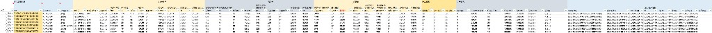

---

## 三、源数据统一梳理

以下为各需求共用源数据，统一说明取数方式与用途：

- **tk 账号信息表**：手动导入，供视频/直播数据与账号维度关联。
- **5 张表**：需按约定时间（如每日 16:00 后）在 TK 后台或积加后台下载，供数据看板与 GMV 计算使用。  
  - **product_list**（3.2）：商品数据分析导出。  
  - **Product campaign data**（3.3）：广告营销 → 实时推广系列数据导出。  
  - **Video Performance List**（3.4）：直播和视频数据分析 → 视频-详细信息导出。  
  - **全渠道商品表**（3.5）：积加全渠道商品导出。  
  - **全部笔订单**（3.6）：订单 API 或管理订单导出。

### 3.1 tk 账号信息表

| 项目 | 说明 |
|------|------|
| 来源 | 手动导入 |
| 说明 | 维护 TK 达人/账号信息，列包括 **Username**、**昵称**、**TikTok uid** 等，供视频/直播数据与账号维度关联使用；需人工导入或更新。 |

**表示例（Username / 昵称 / TikTok uid）**

下图为 tk 账号信息表示例数据：表头为 Username、昵称、TikTok uid，每行对应一个账号，供后续与 Video Performance List 等按 uid 或用户名关联。

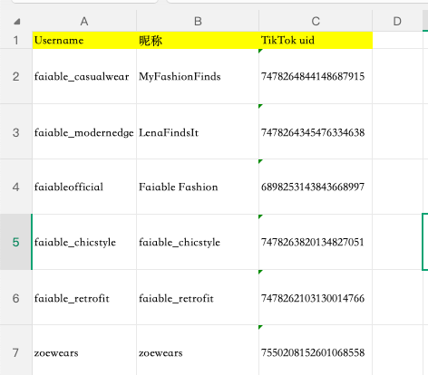

### 3.2 product_list

| 项目   | 说明                                          |
| ---- | ------------------------------------------- |
| 来源   | TK 后台                                       |
| 步骤 1 | 店铺后台 → 数据分析 → 商品数据分析；店铺：美区跨境1/2/3店、英国直邮店:GB |
| 步骤 2 | 商品数据分析 → 在售 → 筛选日期（最新日期）→ 导出 product_list 表 |

**操作图一：商品管理入口**

TikTok Shop 商家中心 → 左侧「商品管理」；商品列表中可看到商品名称、**ID**（即 PID）、已售出、库存、价格、销售工具状态等。需进入「数据分析」→「商品数据分析」进行在售筛选与导出。

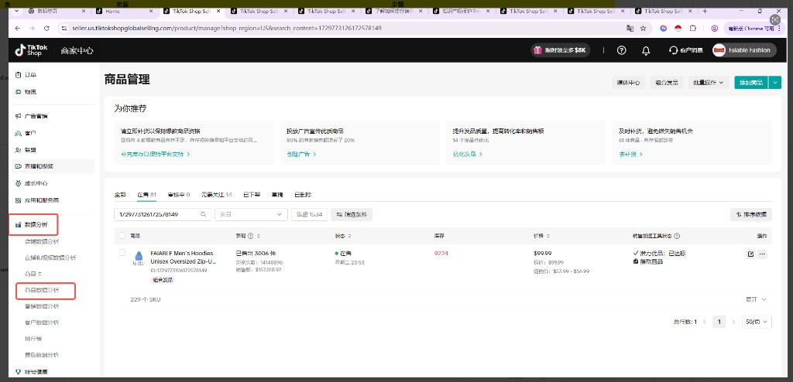

**操作图二：商品数据分析（在售 + 导出）**

左侧「数据分析」→「**商品数据分析**」；右上角选择日期（如 2026/03/04）；筛选「**在售**」；可按商品/SKU 查看 GMV、订单数、状态等。在此页完成筛选后导出即得 product_list 表。

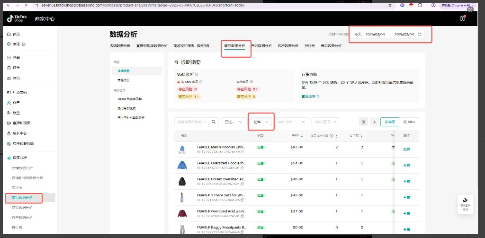

**示例数据（导出后表头与字段示意）**

下图为从 3.2 步骤导出的 product_list 示例数据：含日期范围（如 2024-03-01）、ID（即 PID）、产品名称、商品交易 GMV、支付件数、加购/点击/曝光/浏览/转化等指标列，供映射表取数对照。

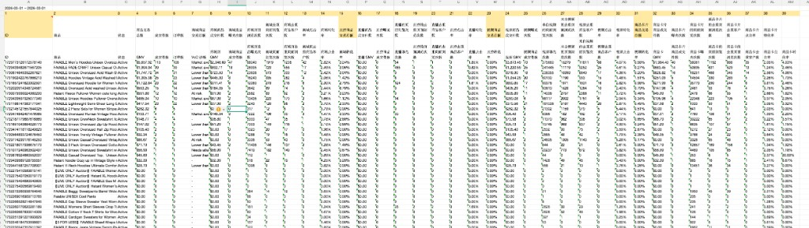

### 3.3 Product campaign data

| 项目   | 说明                                                                  |
| ---- | ------------------------------------------------------------------- |
| 来源   | TK 后台                                                               |
| 步骤 1 | 店铺后台 → 广告营销 → 店铺广告；店铺：美区跨境1店、美区跨境3店、英国直邮店:GB；时间：最新时间                |
| 步骤 2 | 筛选前一天日期 → 导出 → 实时推广系列数据导出 → 导出 Product campaign data 表（时间：最新时间的前一天） |

**操作图一：广告营销 → 店铺广告入口**

TikTok Shop 商家中心 → 左侧「**广告营销**」→「**店铺广告**」；由此进入店铺广告后台，进行 GMV Max 等广告计划查看与导出。

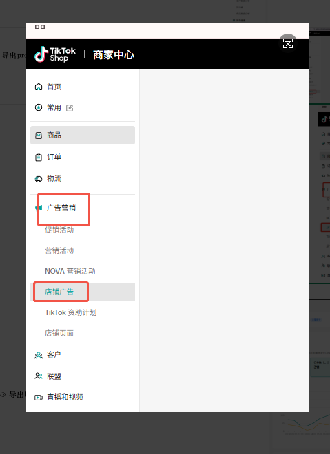

**操作图二：日期筛选与实时推广系列数据导出**

进入店铺广告页后，右上角选择日期（如 2026/03/01）；在「导出」区域选择「**实时推广系列数据**」→ 导出，即可得到 Product campaign data 表（建议取最新时间的前一天）。

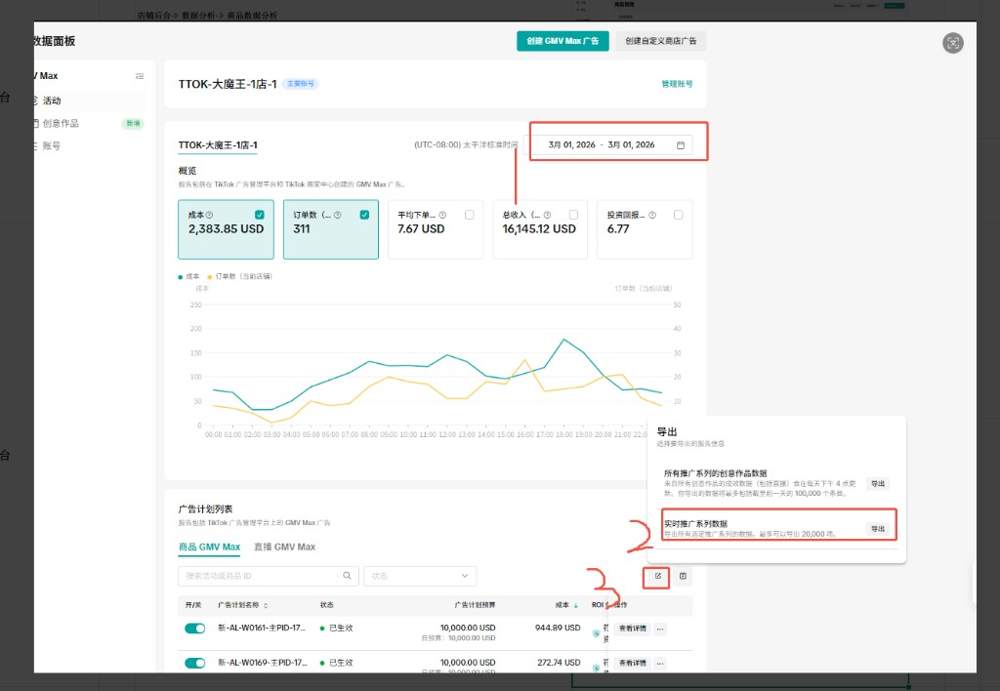

**示例数据（导出后表头与字段示意）**

下图为从 3.3 步骤导出的 Product campaign data 示例数据：含广告计划 ID、广告计划名称（可从中提取 PID）、成本、ROI 保护、净成本、当前预算、SKU 订单数、平均下单成本、总收入、ROI、货币、当前优化模式等列，供映射表取数对照。

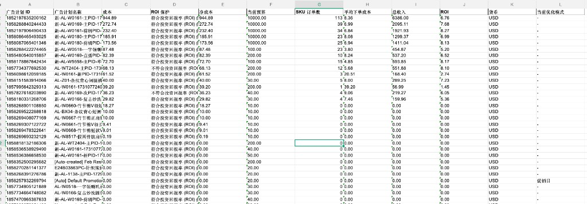

### 3.4 Video Performance List

| 项目   | 说明                                                              |
| ---- | --------------------------------------------------------------- |
| 来源   | 积加（或 TK 后台，以实际为准）                                               |
| 步骤 1 | 积加 → 数据分析 → 直播和视频数据分析 → 视频-详细信息 → 筛选最新时间；店铺：美区跨境1/2/3店、英国直邮店:GB |
| 步骤 2 | 导出数据 → 等待加载完成后下载 → 导出 Video Performance List 表                  |

**操作图一：直播和视频数据分析 → 视频-详细信息**

TK 商家中心 → 左侧「**数据分析**」→ 顶部「**直播和视频数据分析**」→ 左侧子菜单选「视频」→「**详细信息**」；右上角选择日期（如 2026/03/02）；可筛选视频类型、已绑定账号等，页面展示视频列表及 GMV、SKU 订单数等指标。

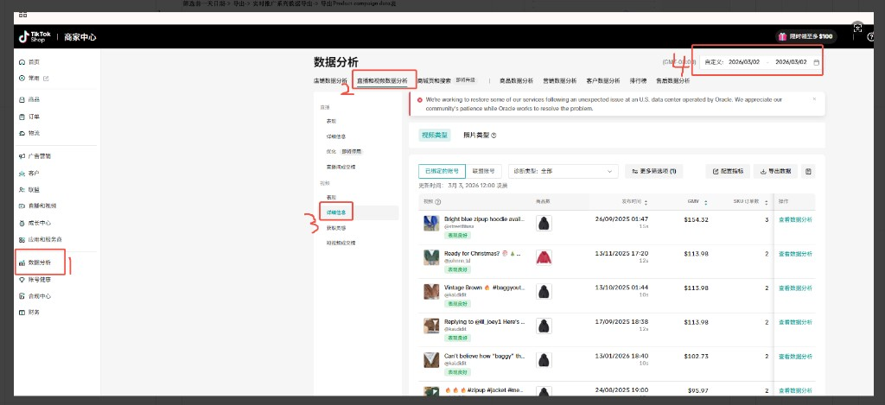

**操作图二：导出数据与下载**

在视频详细信息页点击「**导出数据**」；系统生成报告后，在「已导出文件」弹窗中看到报告名称（如 Video Performance List_日期时间），点击「**下载**」即可得到 Video Performance List 表（报告 7 天内可下载）。

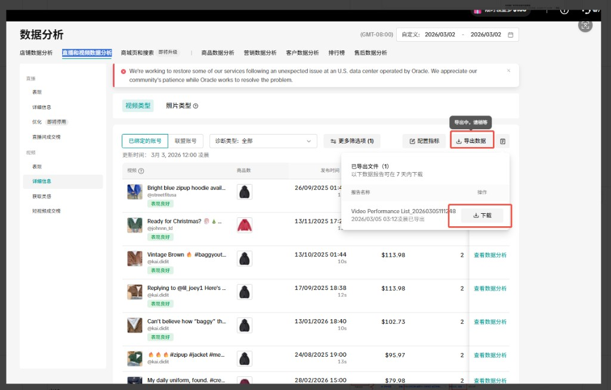

**示例数据（导出后表头与字段示意）**

下图为从 3.4 步骤导出的 Video Performance List 示例数据：含日期范围、达人名称、达人 ID、视频信息、视频 ID、发布时间、商品、分享数、粉丝数、播放数、互动数、商品点击次数、商品点击用户数、免费成交订单数、视频商品总销售额、GMV、平均客单价、点击率、视频转化率、视频完播率、问题等列，供映射与看板取数对照。

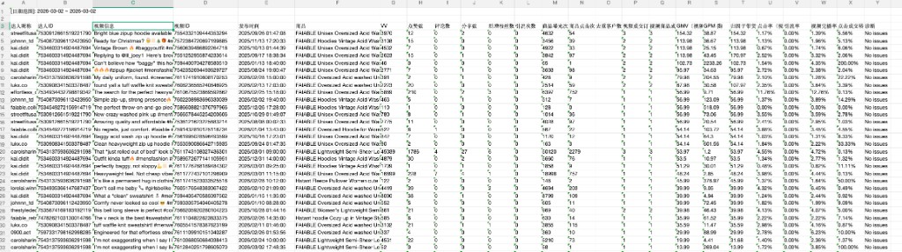

### 3.5 全渠道商品表

| 项目   | 说明                                                          |
| ---- | ----------------------------------------------------------- |
| 来源   | 积加后台                                                        |
| 步骤 1 | 积加 → 销售 → 商品管理 → 全渠道商品 → 筛选店铺 → 筛选在售；店铺：美区跨境1/2/3店、英国直邮店:GB |
| 步骤 2 | 导出 → 根据所选字段导出 → 导出全渠道商品表                                    |

**操作图一：全渠道商品筛选与列表**

积加后台 → 顶部「**销售**」→「**商品管理**」→ 左侧「**全渠道商品**」；筛选「**店铺**」（如 Tiktok自运营/美国TK-艾斯特尼-美区跨境1店）、「**销售状态**」选「在售」；页面展示商品列表（含父ASIN、变体、店铺/站点等），可按需再筛平台、品类等。

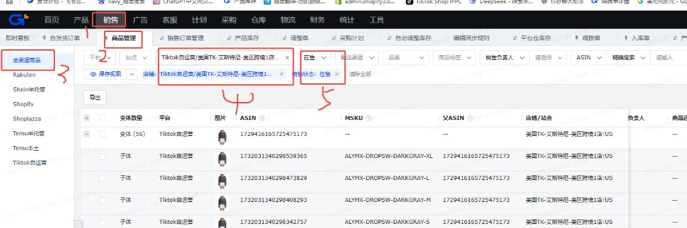

**操作图二：自定义导出**

在全渠道商品列表页点击「**导出**」→ 在「**自定义导出**」弹窗中从「全部字段」勾选需要的列（如 父ASIN、ASIN、SPU、MSKU、店铺/站点 等），在「已选字段及展示顺序」中调整顺序后导出，即得全渠道商品表。

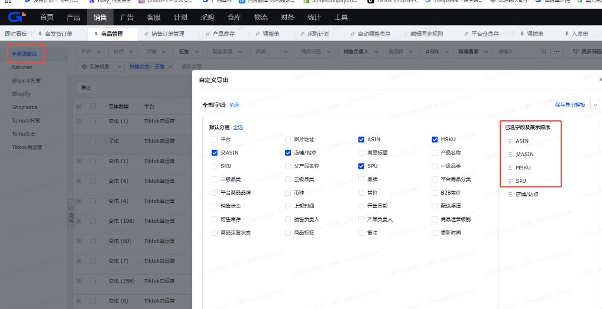

**示例数据（导出后表头与字段示意）**

下图为从 3.5 步骤导出的全渠道商品表示例数据：含商品标题、ASIN、**父ASIN**（即 PID，用于与订单等表关联）、MSKU、SPU、店铺/站点等列；同一父ASIN 下为多变体（不同尺寸/款式），供映射表与 GMV 计算取数对照。

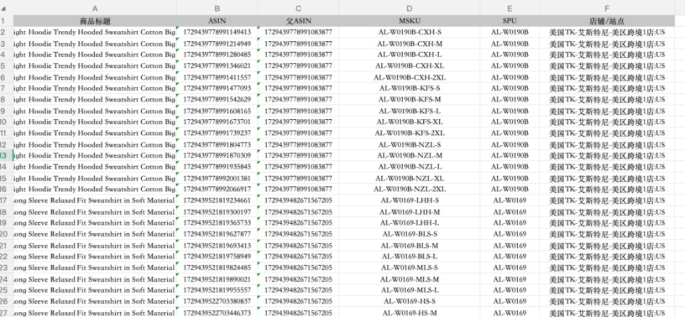

### 3.6 全部笔订单

| 项目   | 说明                                                                     |
| ---- | ---------------------------------------------------------------------- |
| 来源   | API 接口                                                                  |
| 步骤 1 | 调用订单相关 API 接口，按店铺（美区跨境1/2/3店、英国直邮店:GB）、订单付款时间（如最新日期的前一天）等条件请求数据 |
| 步骤 2 | 对接返回的订单明细，按需落表或入仓，供 GMV 计算与数据看板使用                                    |

**操作图一：管理订单与筛选项**

TK 商家中心 → 左侧「**订单**」→「**管理订单**」；选择「**全部**」标签页；打开「筛选项」面板，在「**订单的付款时间**」中选择目标日期（如 2026/03/05 或最新日期的前一天），确认后列表展示该时间段的订单。

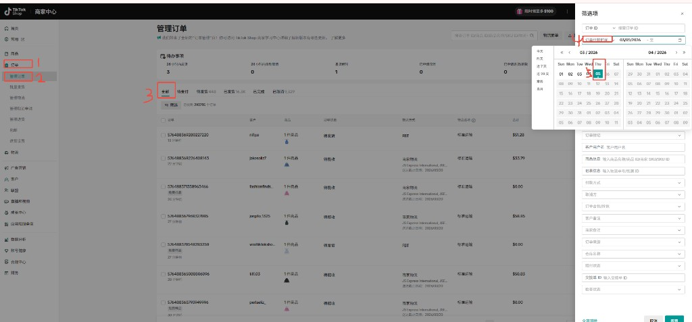

**操作图二：导出订单与下载**

在筛选出的订单列表上方点击「**导出**」图标，打开「导出订单」侧边栏；确认筛选条件（订单付款时间）、选择「筛选出的订单」、格式选「**Excel**」→ 点击「**导出**」；生成后在「导出历史」中点击对应报告（如 全部笔订单-2026-03-05-00-18.xlsx）的「**下载**」即得全部笔订单表（近 7 天可下载）。

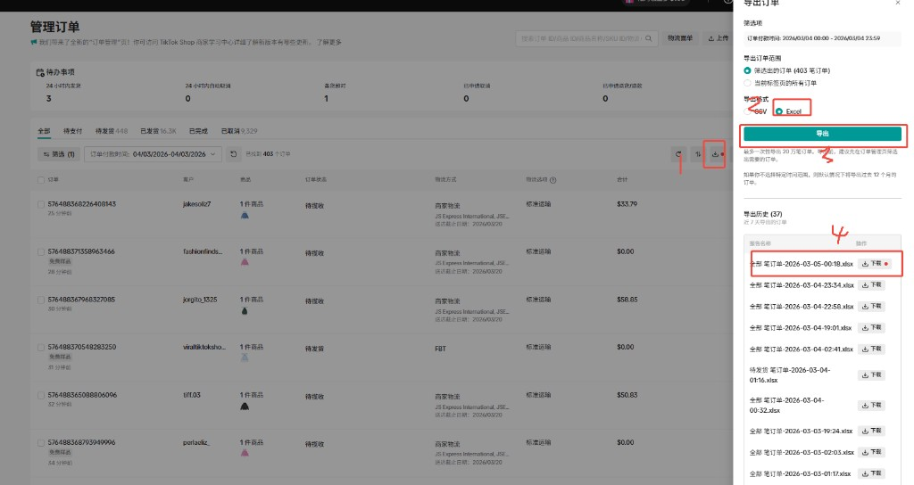

**示例数据（导出后表头与字段示意）**

下图为从 3.6 步骤导出的全部笔订单相关示例数据：含时间、一级/二级/三级分类、PID 名称、PID、以及按日的销售额、销量、客单、月累计、同比、环比等指标列，供 GMV 计算与数据看板取数对照。

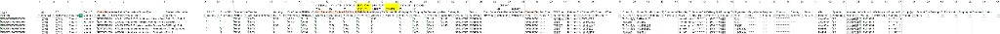

---

## 四、需求与数据对照小结

| 需求  | 核心动作          | 使用的源数据                      | 产出                       |
| --- | ------------- | --------------------------- | ------------------------ |
| 需求一 | 按映射表做 GMV 计算表 | 全部笔订单 + 全渠道商品表              | GMV计算表（PID 维度，供看板使用）     |
| 需求二 | 按映射表做数据看板     | 源数据统一梳理 5 张表 + GMV计算 | 数据看板（PID 维度，GMV/渠道/广告指标） |

---

*详细映射行（含公式、列号）见 `docs/PID销售趋势映射表.xlsx` 的「映射表」sheet。*