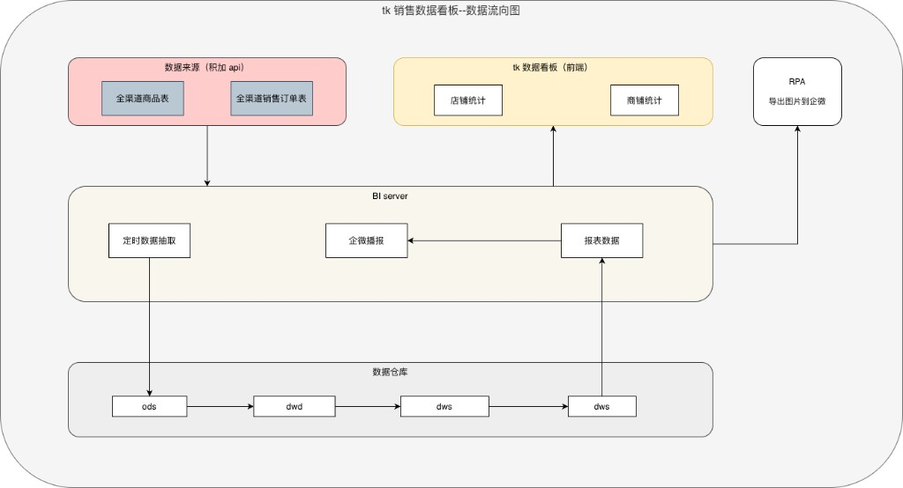
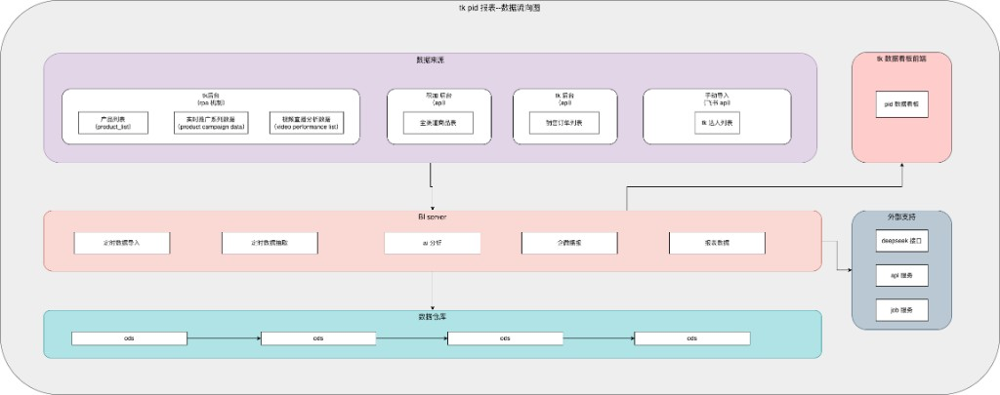

# tkDashboard 技术方案

基于《PID 销售趋势映射 — 需求文档》与《销售数据映射表 — 需求文档》整理。

---

## 一、需求与产出对照

| 需求 | 页面 | 核心动作 | 产出 |
|------|------|----------|------|
| 需求一 | 店铺统计 | 全渠道销售订单表 → 筛选/去重（实付≠0、美区/欧洲时间规则） | 店铺统计列表、导出、每日订单数播报（企微） |
| 需求二 | 商品统计 | 订单表 + 商品表 → 映射 + 近两天差异 + AI 分析 | 商品统计列表、销量趋势界面、AI 分析弹框、PID 明细弹框、导出、异常播报（企微） |
| 需求三 | 数据看板 | GMV 计算表 + 多表（product_list、广告/视频等）→ 映射/计算 | 数据看板列表、每日明细、PID 明细弹框、导出 |

**支撑产出**：GMV 计算表（PID 维度）由全部笔订单 + 全渠道商品表映射/计算得到，供需求三数据看板使用。

---

## 二、数据流转图

### 2.1 tk 销售数据看板 — 数据流向图

数据来源（积加 API：全渠道商品表、全渠道销售订单表）→ BI server 定时数据抽取 → 数据仓库（ods → dwd → dws）→ 报表数据；报表数据 → tk 数据看板前端（店铺统计、商铺统计），并支撑企微播报；RPA 导出图片到企微。

### 2.2 tk PID 报表 — 数据流向图

数据来源：产品列表（product_list）、实时推广系列（product campaign data）、视频直播分析数据（video performance list）；tk 后台（API）— 全商品表；手动导入（飞书 API）— tk 达人列表。→ BI server（实时数据导入、分析数据提取、ad 分析、企微、报表数据）→ 数据仓库（ods）；报表数据 → tk 数据看板前端（pid 数据看板）；企微 → 外部支持（deepseek 接口、api 服务、job 服务）→ pid 数据看板。

---

## 三、技术要点

### 3.1 数据源与接入

| 数据 | 来源 | 说明 |
|------|------|------|
| 全部笔订单 | API 接口 | 按店铺、付款时间等条件请求，替代原 TK 后台导出 |
| 全渠道商品表 / 全渠道销售订单表 | 积加后台 | 导出或 API（以实际为准） |
| product_list / Product campaign data | TK 后台 | 商品数据分析、广告营销导出 |
| Video Performance List | 积加或 TK | 直播与视频数据分析 |
| 产品阶段、tk 账号信息 | 手动 | 表格维护或导入 |

### 3.2 计算与映射

- **PID 需求一**：订单按 Seller SKU 关联商品表取父 ASIN（PID），按映射表做筛选、汇总与公式（总 GMV、每单补贴、客单价等）。
- **PID 需求二**：以 product_list 为底表，关联全渠道商品表、产品阶段、GMV 计算表、Product campaign data、Video Performance List 等，按数据看板映射表做字段与占比计算。
- **销售需求一**：按需求文档规则筛选订单（实付≠0、美区/欧洲时间），按店铺 + 平台订单编号去重得订单数。
- **销售需求二**：同规则筛选后关联商品表补 PID/SPU，落表「TK-独立站数据销量趋势数据」；在此基础上算近 7 天、近两天差异，再经 AI 做异常识别与播报。

### 3.3 展示与播报

- **看板**：GMV 计算表、PID 数据看板、销量趋势界面（含店铺/日期/PID 筛选，冻结列等）— 前端或 BI 展示。
- **播报**：订单数播报、异常播报 → 企微项目群（接口或机器人推送）。

---

## 四、排期列表

*参考地址：https://alidocs.dingtalk.com/i/nodes/vNG4YZ7JnP4dr2w4cqL65rMyW2LD0oRE*

---

*文档版本：基于当前两份需求文档整理，数据流转以附图为准，数据源与规则以需求文档为准。*
