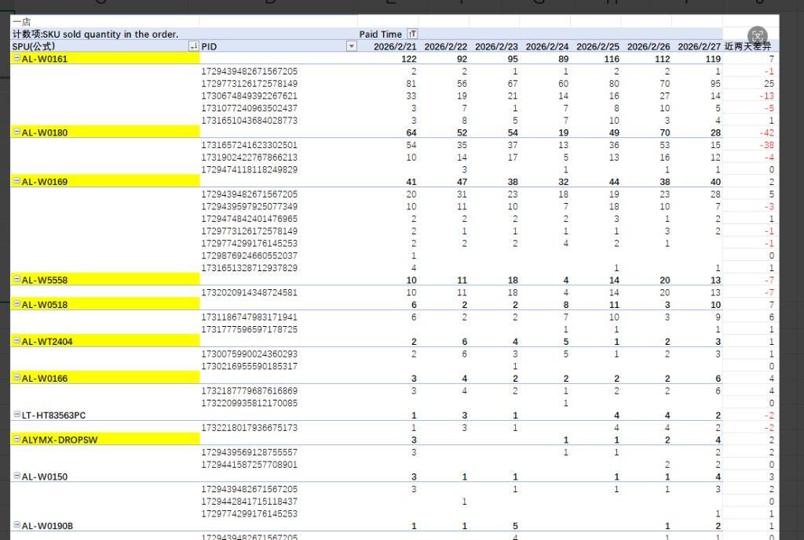
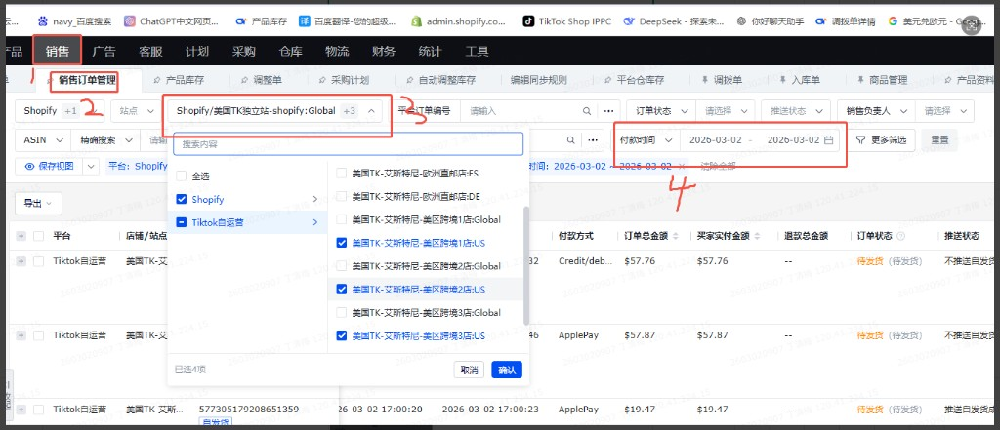
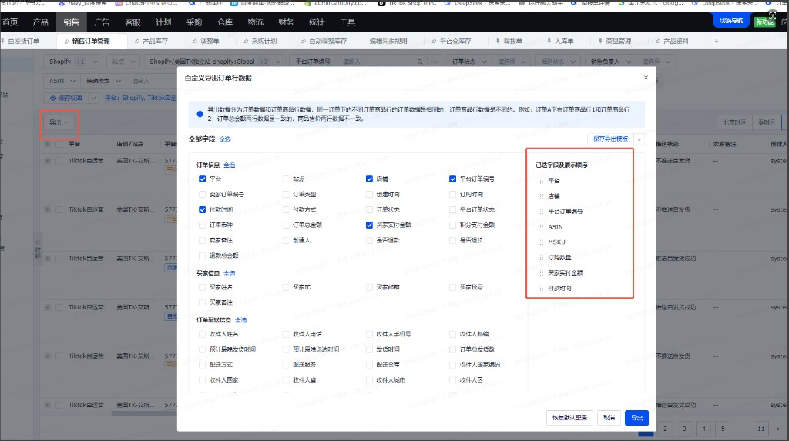
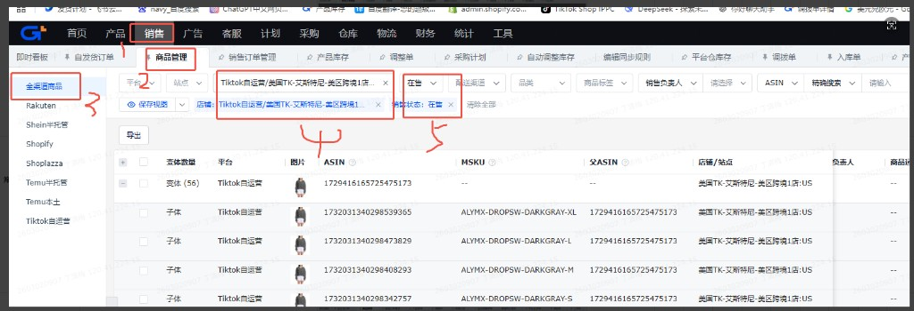
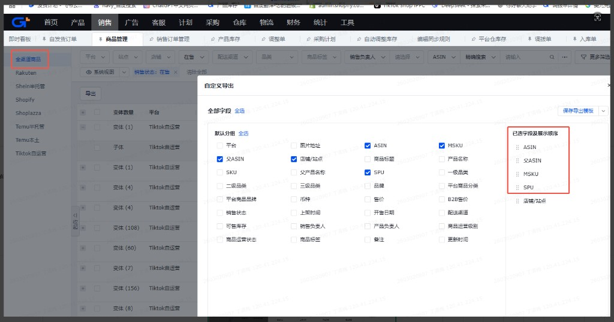

#  销售数据映射表 — 需求文档

---

## 一、需求一：每日订单数播报

### 1.1 需求描述

- **数据范围**：仅使用源数据表「全渠道销售订单表」。
- **筛选规则**：
  - 买家实付金额不为零。
  - **美区**：付款时间早于当日 **夏令时 18:00 / 冬令时 17:00**。
  - **欧洲**：不限制时间，取全部符合「实付不为零」的数据。
- **统计与播报**：按「店铺 + 平台订单编号」去重得到订单数，按店铺播报到企微项目群。

### 1.2 流程

1. 从「全渠道销售订单表」按上述规则筛选数据。
2. 按「店铺 + 订单号」去重，得到各店铺当日订单数。
3. 将结果播报到企微项目群。

### 1.3 最终目标结果

需求一达成的目标：**按日、按店铺的订单数播报**，在企微项目群中呈现如下形式。

| 日期 | 店铺 | 订单数 |
|------|------|--------|
| 2月27日（美国时间） | 美国 TK・艾斯特尼 - 欧洲直邮店 IT | 12 |
| 2月27日（美国时间） | 美国 TK・艾斯特尼 - 欧洲直邮店 FR | 8 |
| 2月27日（美国时间） | 美国 TK・艾斯特尼 - 欧洲直邮店 ES | 5 |
| 2月27日（美国时间） | 美国 TK・艾斯特尼 - 欧洲直邮店 DE | 10 |
| 2月27日（美国时间） | 美国 TK・艾斯特尼 - 美区特 1 店 US | 230 |
| 2月27日（美国时间） | 美国 TK・艾斯特尼 - 美区特 2 店 US | 0 |
| 2月27日（美国时间） | 美国 TK・艾斯特尼 - 美区特 3 店 US | 3 |
| 2月27日（美国时间） | 美国TK独立站-shopify:Global | 0 |
| 2月27日（美国时间） | **合计** | **268** |

*企微发送文案示例：*  
`2月27日（美国时间）订单数：欧洲直邮店 IT 12 / FR 8 / ES 5 / DE 10 / 美区特1店 230 / 美区特2店 0 / 美区特3店 3 / 独立站 0 @所有人`

### 1.4 映射

本需求不涉及独立映射表，直接基于「全渠道销售订单表」的店铺、平台订单编号做去重统计。源数据取数方式见本文「三、源数据统一梳理」。

---

## 二、需求二：订单明细与销量趋势 + 近两天差异 + 异常播报

### 2.1 需求描述

- **数据范围**：仅使用「全渠道销售订单表」，筛选规则与需求一一致：
  - 买家实付金额不为零。
  - **美区**：付款时间早于当日 夏令时 18:00 / 冬令时 17:00。
  - **欧洲**：不限制时间，全部数据。
- **目标**：  
  ① 映射到「订单明细」（剔除支付金额为 0、支付时间为空）；  
  ② 分析近两天差异，基于近 7 天 SPU 下 PID 销量变化并播报；  
  ③ 用 AI 分析 PID 销量异常并做异常播报。

### 2.2 流程

1. **数据清洗与映射**：按上述规则筛选「全渠道销售订单表」，并关联「全渠道商品表」补 PID/SPU，映射到「订单明细」及最终展示表（见 2.3 映射表）。
2. **近两天差异**：基于近 7 天数据，计算 SPU 下 PID 销量变化，将结果播报到企微项目群。
3. **异常播报**：基于上一步结果，用 AI 识别销量增减异常的 PID，做异常情况播报。

**涉及店铺：**  
美国 TK・艾斯特尼 - 欧洲直邮店 IT / 美国 TK・艾斯特尼 - 欧洲直邮店 FR / 美国 TK・艾斯特尼 - 欧洲直邮店 ES / 美国 TK・艾斯特尼 - 欧洲直邮店 DE / 美国 TK・艾斯特尼 - 美区特 1 店 US / 美国 TK・艾斯特尼 - 美区特 2 店 US / 美国 TK・艾斯特尼 - 美区特 3 店 US / 美国TK独立站-shopify:Global

### 2.3 映射表

- **最终数据表**：`TK-独立站数据销量趋势数据`
- **源表**：全渠道销售订单表（主）、全渠道商品表（按 **asin** 关联补 PID、SPU）

| 条件/公式 | 关联字段 | 源数据表 | 源字段名称 | 最终数据表 | 目标字段 |
|-----------|----------|----------|------------|------------|----------|
| — | — | 全渠道销售订单表 | 付款时间 | TK-独立站数据销量趋势数据 | Paid Time |
| 提取付款时间的年月，格式 202502 | — | 全渠道销售订单表 | （公式） | TK-独立站数据销量趋势数据 | 归属月份(公式) |
| — | — | 全渠道销售订单表 | 店铺 | TK-独立站数据销量趋势数据 | 店铺 |
| — | — | 全渠道销售订单表 | 平台订单编号 | TK-独立站数据销量趋势数据 | order id |
| — | — | 全渠道销售订单表 | asin | TK-独立站数据销量趋势数据 | Platform SKU ID. |
| — | — | 全渠道销售订单表 | msku | TK-独立站数据销量趋势数据 | Seller sku input by the seller in the product system. |
| — | — | 全渠道销售订单表 | 订购数量 | TK-独立站数据销量趋势数据 | SKU sold quantity in the order. |
| — | — | 全渠道销售订单表 | 买家实付金额 | TK-独立站数据销量趋势数据 | Order total amount paid by the buyer. |
| — | asin | 全渠道商品表 | 父ASIN | TK-独立站数据销量趋势数据 | PID |
| — | asin | 全渠道商品表 | SPU | TK-独立站数据销量趋势数据 | SPU(公式) |

### 2.4 最终目标结果

需求二达成的目标包含三类产出：

| 序号 | 目标结果 | 说明 |
|------|----------|------|
| ① | **最终数据表展示（含店铺搜索）** | 基于「TK-独立站数据销量趋势数据」等清洗后的数据，在界面上提供**最终数据表展示**，并支持**按店铺搜索/筛选**，便于按单店查看订单明细与销量趋势。 |
| ② | **销量趋势界面（参考下图效果）** | 界面需达到与下图类似的展示效果：按**店铺**（如「一店」）为维度，以 **SPU → PID** 层级展示；按 **Paid Time** 日期的**每日销量**（计数项：SKU sold quantity in the order）；含 **近两天差异** 列（负值可用红色等突出显示）；SPU 行可高亮/加粗以区分汇总与明细。支持按日期、PID 等筛选。 |
| ③ | **异常播报** | 基于上述差异数据，由 AI 识别销量增减异常的 PID，并将异常情况播报到企微项目群。 |

**结果① 列表 demo（最终数据表字段与示例行）**

数据表：`TK-独立站数据销量趋势数据`。列与 2.3 映射表中的目标字段一致，界面需支持按「店铺」搜索/筛选。

| Paid Time | 归属月份(公式) | 店铺 | order id | Platform SKU ID. | Seller sku... | SKU sold quantity in the order. | Order total amount paid by the buyer. | PID | SPU(公式) |
|-----------|----------------|------|----------|------------------|---------------|----------------------------------|----------------------------------------|-----|-----------|
| 2026-02-27 10:15 | 202602 | 美区跨境1店:US | ORD-20260227-001 | 1729439482671567205 | AL-W0161-DARKGRAY-XL | 2 | 57.76 | 1729439482671567205 | AL-W0161 |
| 2026-02-27 11:22 | 202602 | 美区跨境1店:US | ORD-20260227-002 | 1731657241623302501 | AL-W0180-BLACK-L | 1 | 29.99 | 1731657241623302501 | AL-W0180 |
| 2026-02-27 14:08 | 202602 | 美区跨境3店:US | ORD-20260227-003 | 1729416165725475173 | ALYMX-DROPSW-DARKGRAY-M | 1 | 19.47 | 1729416165725475173 | ALYMX-DROPSW |
| 2026-02-26 09:30 | 202602 | 英国直邮店:GB | ORD-20260226-004 | 1729439482671567205 | AL-W0161-DARKGRAY-S | 3 | 89.97 | 1729439482671567205 | AL-W0161 |

**② 界面效果参考示意：**

- 顶部：当前所选店铺（如「一店」）。
- 列：SPU(公式)、PID、Paid Time（多列按日，如 2026/2/21～2/27）、**近两天差异**。
- 行：每个 SPU 一行汇总（高亮/加粗），其下为所属 PID 明细行；数量为当日订单内 SKU 销量。
- 近两天差异：可为正负值，负值建议红色等视觉区分。

---

## 三、源数据统一梳理

以下为两个源表的取数方式，需求一、需求二共用；来源均为 **积加后台**。

### 3.1 全渠道销售订单表

| 项目 | 说明 |
|------|----------|
| 来源途径 | 积加后台 |
| 步骤 1 | 积加 → 销售 → 销售订单管理 → 筛选店铺 → 筛选付款时间 |
| 步骤 2 | 导出 → 根据所选字段导出 → 导出全渠道销售订单表 |
| 店铺范围 | 美国 TK・艾斯特尼 - 欧洲直邮店 IT 美国 TK・艾斯特尼 - 欧洲直邮店 FR 美国 TK・艾斯特尼 - 欧洲直邮店 ES 美国 TK・艾斯特尼 - 欧洲直邮店 DE 美国 TK・艾斯特尼 - 美区特 1 店 US 美国 TK・艾斯特尼 - 美区特 2 店 US 美国 TK・艾斯特尼 - 美区特 3 店 US 美国TK独立站-shopify:Global |

**操作图一：筛选与列表**

进入「销售」→「销售订单管理」后，在站点/店铺处选择平台（如 Shopify、Tiktok自运营）及具体店铺（如美区跨境1/2/3店），在「付款时间」选择日期范围，即可在下方列表中查看订单（含付款方式、订单总金额、买家实付金额、订单状态等）。

**操作图二：自定义导出订单行数据**

点击「导出」→「根据所选字段导出」，在弹窗「自定义导出订单行数据」中勾选需要的字段并调整顺序。建议导出字段包含：平台、店铺、平台订单编号、ASIN、MSKU、订购数量、买家实付金额、付款时间等，与映射表源字段一致。确认后导出即得全渠道销售订单表。

### 3.2 全渠道商品表

| 项目 | 说明 |
|------|----------|
| 来源途径 | 积加后台 |
| 步骤 1 | 积加 → 销售 → 商品管理 → 全渠道商品 → 筛选店铺 → 筛选在售 |
| 步骤 2 | 导出 → 根据所选字段导出 → 导出全渠道商品表 |
| 店铺范围 | 同上 8 个店铺 |

**操作图一：筛选与列表**

进入「销售」→「商品管理」→ 左侧「全渠道商品」后，在「店铺」处选择目标店铺（如 Tiktok自运营/美国TK-艾斯特尼-美区跨境1店:US），在「销售状态」选择「在售」，即可在下方列表中查看商品（含变体数量、平台、图片、ASIN、MSKU、父ASIN、店铺/站点等）。可按平台、站点、品类等进一步筛选。

**操作图二：自定义导出**

点击「导出」→「自定义导出」，在弹窗中勾选需要导出的字段并调整顺序。与映射表关联时建议包含：ASIN、父ASIN、MSKU、SPU、店铺/站点等。确认后导出即得全渠道商品表。

---

## 四、需求与数据对照小结

| 需求 | 核心动作 | 使用的源数据 | 时间与金额规则 |
|------|----------|--------------|----------------|
| 需求一 | 店铺+订单去重 → 订单数播报 | 全渠道销售订单表 | 实付≠0；美区 18:00/17:00 前，欧洲不卡时间 |
| 需求二 | 订单明细映射 → 近两天/7天 PID 销量差异 → AI 异常播报 | 全渠道销售订单表 + 全渠道商品表(asin) | 同上 |
